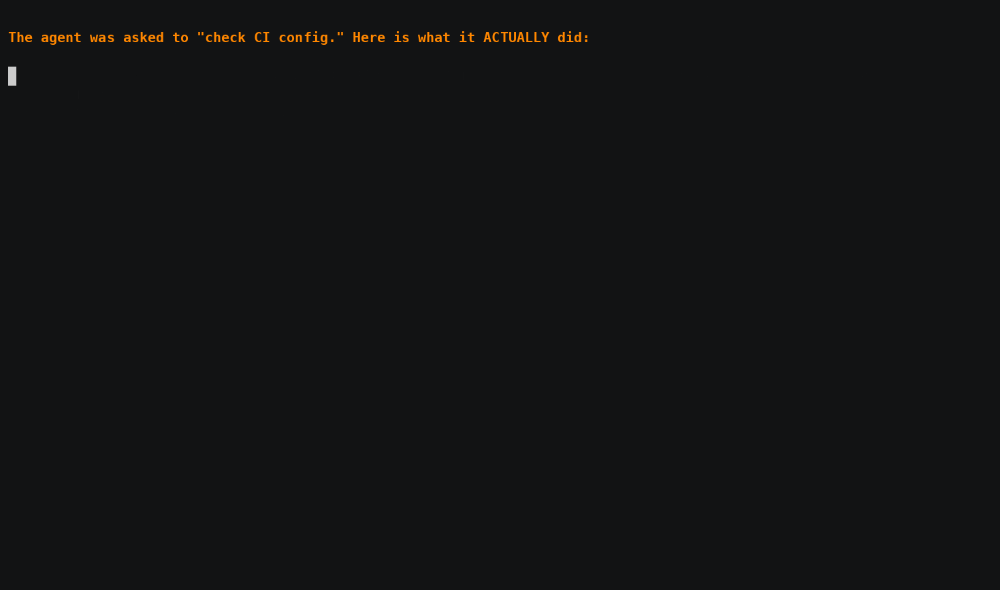

# agentrec demo

A self-contained, 80-second demo: an AI agent is asked to *"check the CI
configuration"* — but the kernel sees it read your cloud credentials and poke the
Docker socket. Then `--enforce` denies the read in-kernel. It's the whole pitch in
one take, and it's **safe**: it stages a fake credentials file in an isolated demo
home and never touches your real secrets.



## What's here

- **`demo-agent.sh`** — a stand-in "coding agent." Announces a benign task, calls
  `agentrec mark` to declare intent, then reads a (fake) `~/.aws/credentials` and
  touches `/var/run/docker.sock`.
- **`record-demo.sh`** — stages the fake creds, then runs the agent twice: once to
  record what it did, once with `--enforce` to block it. Cleans up after itself.

## Prerequisites

- A Linux host with the agent installed (`curl -fsSL https://agentrec.io/install.sh | sudo sh`), kernel 5.8+ with BTF. Enforcement needs BPF-LSM in the kernel's active LSM list (`cat /sys/kernel/security/lsm` — look for `bpf`).
- An ingest token (`ar_ing_…`) for a workspace that has a **block rule** matching the read:
  `event=open · field=path · op=suffix · pattern=.aws/credentials · action=block`.
  Most workspaces ship with it; add it in the console's **Rules** panel if yours doesn't.

## Run it

```sh
export AGENTREC_ENDPOINT=https://api.agentrec.io
export AGENTREC_TOKEN=ar_ing_...

DEMO_FAST=1 ./record-demo.sh    # quick dry run (no pauses) — check the output first
./record-demo.sh                # the real, paced take
```

## Record it as a GIF

[asciinema](https://asciinema.org) gives crisp text; [`agg`](https://github.com/asciinema/agg) turns it into a GIF.

```sh
sudo apt-get install -y asciinema          # or: brew install asciinema
asciinema rec demo.cast -c './record-demo.sh'
agg --font-size 20 --theme asciinema demo.cast demo.gif
```

Tips for a clean take:
- Terminal ~100×32, a legible mono font, dark theme (matches the product).
- One take. If you fumble, re-run — it's idempotent.
- Trim dead air at the ends when you export.

## The narration / captions

1. *"I asked a coding agent to check the CI configuration."*
2. *(take 1)* *"It said it was reading config. The kernel saw it read my AWS keys and poke the Docker socket — attributed to that exact 'check CI config' step."*
3. *(take 2, with `--enforce`)* *"Same agent, enforcement on. The credential read is denied in-kernel — a clean `-EPERM` — and the agent keeps running."*
4. *Close:* *"It reported 'check CI configuration.' The kernel saw the truth. agentrec — free, open source, one command."*
